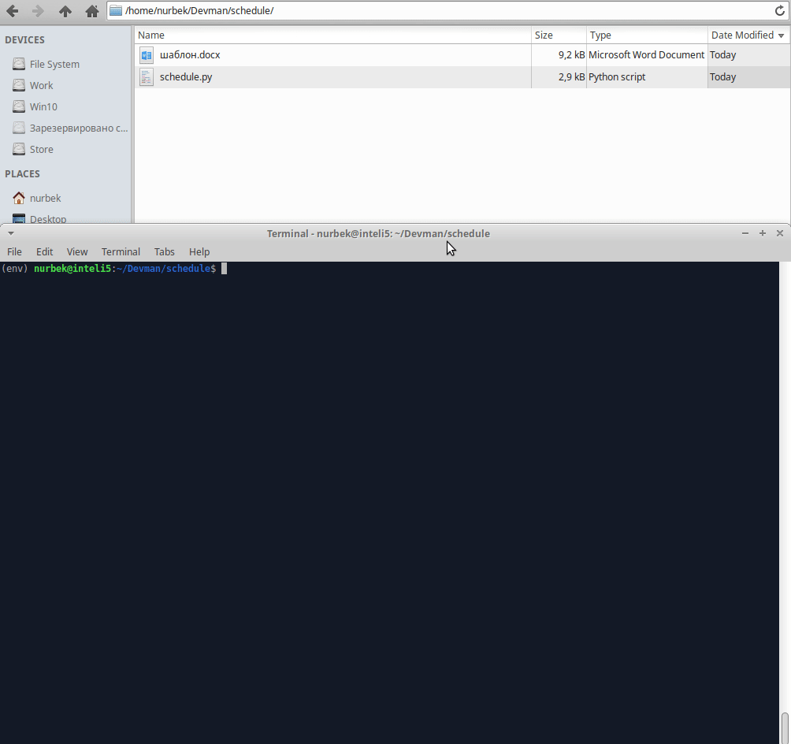

# Заполнение расписания в MS WORD

Скрипт автоматически формирует расписание в документе ms word на основании шаблона. Расписание формируется случайным образом, в разные промежутки времени в течении суток.

## Установка

Python3 должен быть установлен. Используйте pip (или pip3, если есть конфликт с Python2) для установки зависимостей:

```
pip install -r requirements.txt
```

## Запуск

Запускают скрипт со следующими необязательными параметрами:

1. ```-h, --help```                       Справка по параметрам скрипта
2. ```-f FILE, --file FILE```             Файл ms word с расписанием проверок
3. ```-t TEMPLATE, --template TEMPLATE``` Шаблон ms word
4. ```-d DATE, --date DATE```             Дата формирования расписания в формате %dd.%mm.%YYYY
5. ```-o OBJECTS [OBJECTS ...], --objects OBJECTS [OBJECTS ...]``` Список объектов
6. ```-r HOUR, --hour HOUR```             Час начала расчета расписания
7. ```-s STEP, --step STEP```             Время между проверками в минутах


```
python.exe main.py -t template.docx -f generated_doc.docx -d 01.01.2018 -o Объект1 Объект2 Объект3 -r 8 -s 5
```	




## Цели проекта

Код написан в учебных целях — это урок в курсе по Python и веб-разработке на сайте [Devman](https://dvmn.org).
